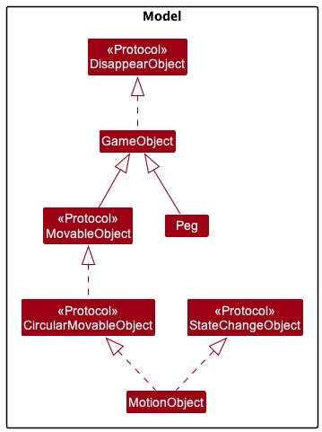
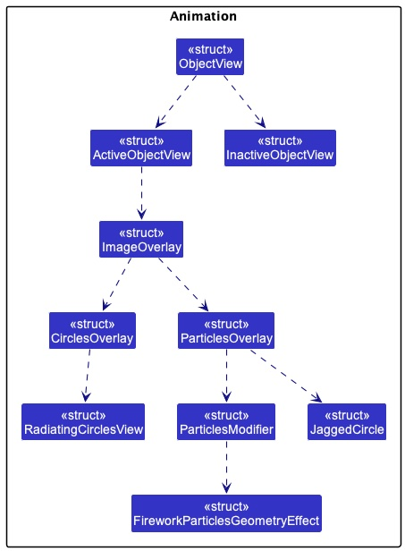
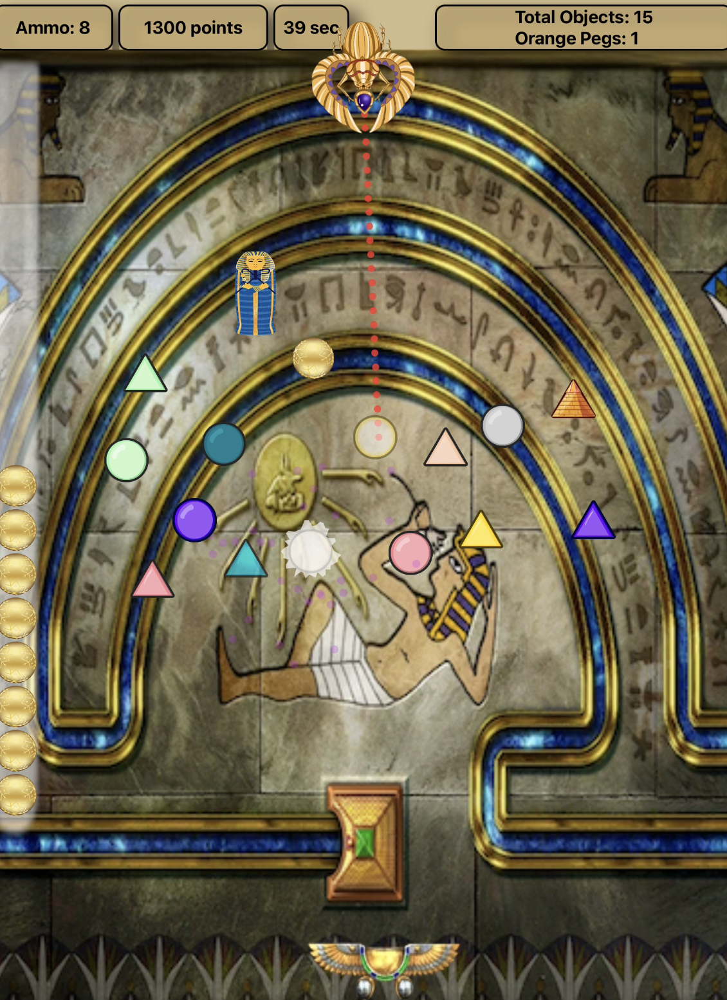
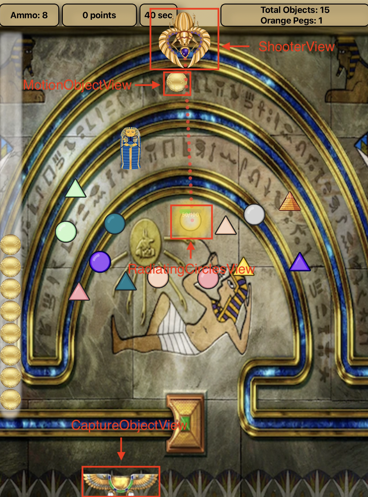
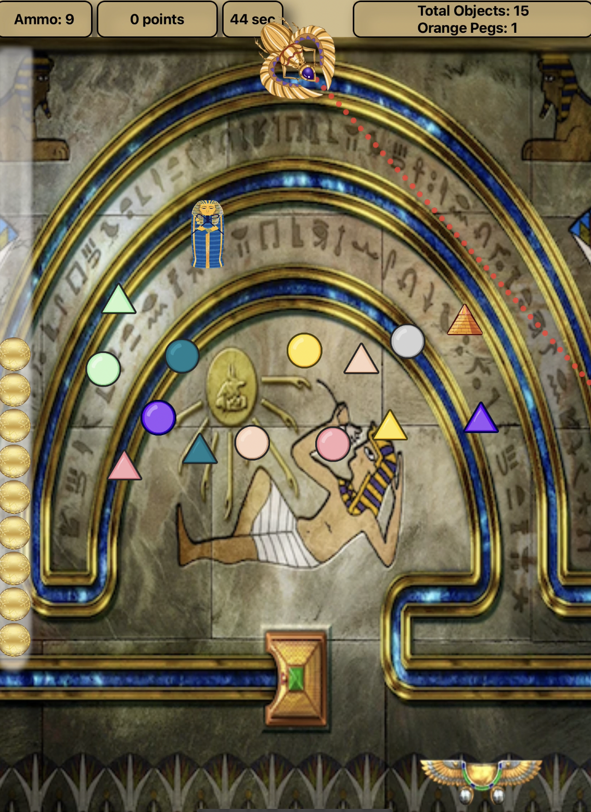

[](https://classroom.github.com/a/BAJPqr99)
# CS3217 Problem Set 4

**Name:** Muhammad Reyaaz

**Matric No:** A0218022W

## Tips
1. CS3217's docs is at https://cs3217.github.io/cs3217-docs. Do visit the docs often, as
   it contains all things relevant to CS3217.
2. A Swiftlint configuration file is provided for you. It is recommended for you
   to use Swiftlint and follow this configuration. We opted in all rules and
   then slowly removed some rules we found unwieldy; as such, if you discover
   any rule that you think should be added/removed, do notify the teaching staff
   and we will consider changing it!

   In addition, keep in mind that, ultimately, this tool is only a guideline;
   some exceptions may be made as long as code quality is not compromised.
3. Do not burn out. Have fun!

## Notes

The kaboom peg is the orange peg and the spook ball is the green peg

Since no ios requirements has been specified, some of the animations would work with ios 15 and below.

The coordinate system used follows the UI coordinate system, where the top left is the (0, 0) coordinate, and the y-coordinate increases as we proceed downwards, while the x-coordinate increases as we proceed to the right.

Only portrait mode is supported for this game.

I've also implemented a restriction where a level must have at least one peg before it can be saved. This requirement ensures that the level builder serves its purpose, as having no pegs at all would defeat its purpose.

This information has been mentioned in the integration test, but I believe it's beneficial to reiterate it here. The loading functionality consists of two main features. Firstly, if there's no text in the text field, a list of saved levels will be displayed. Secondly, if the text field contains text, the application will attempt to load the level after converting it to lowercase. The reason for converting to lowercase is to simulate the behavior of the Apple ecosystem, where filenames differing only in capitalization are not permitted when saving. Similarly, I've followed this principle to ensure consistency. A level name will only be considered different if it contains distinct alphanumeric characters or spaces.

## Developer Guide

### 

This project utilizes the Model-View-ViewModel (MVVM) design pattern. MVVM effectively segregates the business and presentation logic of the Peggle application from its user interface (UI). The domain logic is the Model, while the presentation logic is the View Model. The View is responsible for displaying the User Interface (UI) elements to the user. This segregation simplifies unit testing, enabling the creation of tests for the view model and model without involving the view directly. Consequently, the unit tests for the view model accurately simulate the functionality experienced by the user, facilitating integration testing.

Additionally, MVVM allows the modification of the view independently of the logic and vice versa. For instance, the style of the palette buttons could be modified by aligning the pegs to the left and the delete button to the right without altering the underlying logic. Thus, maintaining a clear division between application logic and the UI addresses various development challenges, enhances testability, simplifies maintenance, and encourages code reusability. The main interactions between components of the MVVM can be seen here:


We will start from the bottom layer, which is the Model, followed by the View Model, and finally, the View.

## Model 

In the Model, the `Point` struct primarily captures the location of game objects and encapsulate it, rather than directly attaching variables for x and y coordinates to the game object. Additionally, the `Point` struct features `setCartesian` and `setPolar` methods to accommodate both rectangular and polar coordinates, respectively. By disallowing direct modification of individual x and y coordinates and requiring them to be assigned together, the implementation of the game object's location is effectively hidden, adhering to sound Software Engineering Practices.

The primary purpose of the `Vector` struct is to model the displacement of points. Utilizing a vector for point displacement offers mathematical rigor in representing point shifts. Consequently, the `add` and `subtract` methods in the `Point` struct depend on the `Vector` struct to achieve their functionality. This approach ensures consistency and mathematical precision in handling point transformations within the application.

Furthermore, there is a `Level` struct designed to conform to the Codable protocol. This conformance enables seamless encoding and decoding, facilitating the storage of level data within the CoreDataManager, a feature which will be elaborated on later in the guide.

In the Model, a superclass named `GameObject` has been created to represent game objects. The decision to use classes for these representations was motivated by the need to mutate game object data while maintaining reference to the original object. To ensure rigorous software engineering principles, `makeDeepCopy()` in classes ensures deep copy done. This enables functionalities like dragging pegs across the screen while following software principles. Subsequently, a `MovableObject` protocol was established, inheriting from `GameObject`. From there, a `CircularMovableObject` protocol, `TriangularMovableProtocol` and `RectangularMovableProtocol` was derived, inheriting from `MovableObject`. The `Peg` class extends both `CircularMovableObject` and `GameObject`. The rationale behind introducing the shape protocols is twofold: to adhere to object-oriented principles and to employ a design pattern reminiscent of the decorator pattern. This design approach ensures extensibility while preserving closure to modification, thereby upholding the open-closed principle.

Here is the class diagram representing the various aforementioned models present in the application.


## View Model

In order to adhere to the MVVM design pattern, it's essential that models remain unaware of any dependencies. Consequently, an intermediary is necessary to update the model. In MVVM, this intermediary is the View Model. The View Model observes changes in the view and updates the model accordingly. Since the View Model is responsible for coordinating the view's interactions with any required model classes, there's typically a one-to-many relationship between the View Model and the model classes. The View Model might opt to directly expose model classes to the view, allowing controls in the view to bind data directly to them. In such cases, the model classes must be designed to support data binding. Specifically, the Level model is designed to accept modified game objects. As Level conforms to Codable, it can encode and decode data from CoreDataManager, a feature that will be elaborated on later in this guide.

Each view model serves to provide data from a model in a format that the view can readily utilize. To achieve this, the view model often engages in data conversion. Placing this conversion logic within the view model is advantageous as it furnishes properties that the view can seamlessly bind to.

In this application, three view models are employed. One of them is the `ObjectViewModel`, which conducts straightforward data conversion by deriving the width via `calculateWidth()` and the height via `calculateHeight()` from the radius. Additionally, it sets the `isSelected` option to false initially. This approach ensures that the view does not highlight any elements initially, aligning with the correct behavior, as highlighting a peg should only occur upon tapping the corresponding peg in the palette button panel. Furthermore, the view models refrain from referencing view types, such as Button and ListView, from within the view models. By adhering to the principles outlined here, view models can be tested in isolation, thereby minimizing the likelihood of software defects by constraining the scope.

The other view model is `CanvasViewModel`, which handles the logic of rendering of pegs on the screen as well as the logic of dragging of pegs on the screen. The `CanvasViewModel` is the intermediary between the `Peg` model, the `GameObject` model and the `Level` model.

The final view model in the application is the `ActionButtonsViewModel`. This view model acts as an intermediary, updating the persistence `CoreDataManager` when the user clicks "save" on valid data or "load" on saved levels. Data is considered valid when the level name contains only alphanumeric characters and there is at least one game object present on the canvas view.

## View
<a name="view"></a>

The following images depict the views referenced in the subsequent sections. These images also showcase the current latest implementation of the project, aiding in the connection between words and visuals.

The CanvasView, referenced in subsequent sections, is labelled here:


The ObjectView, BackgroundView, and PaletteView are labelled here:


The PaletteButtonsView, ObjectView, DeleteButtonView, and ActionButtonView are labelled here:


The LevelSelectionView is labelled here:


The views handle UI functionalities such as button clicks and user dragging interactions. These views are constructed using SwiftUI and rely on the view model to act as an intermediary to the models.

Several additional UI details have been implemented. Firstly, to address the challenge of placing game objects at the top due to the status bar, the status bar is hidden, making it easier for users to position objects near the border's top. Additionally, alerts have been implemented to notify users in two scenarios: when attempting to save without placing any game objects, and when attempting to enter a non-alphanumeric level name. Also, the view has been implemented such that the game objects are tightly packing and almost touching each other, as seen here:


Here is the overall general class diagrams for the view to show which view depends on which:


Now that the elaboration of the model, view model, and view is complete, the diagram below provides a holistic class-level representation. This diagram encapsulates the aforementioned explanations regarding the model, view model, and view.


### Add game objects

To incorporate new game objects using SwiftUI, I utilized BackgroundView().gesture(DragGesture(minimumDistance: 0).onEnded and passed the encapsulated coordinates into the canvasViewModel. The canvasViewModel then evaluates whether the new object intersects with the borders or existing game objects. If the new object does not intersect with anything, it is added to the list of general game objects. Here is the sequence diagram when a user attempts to add a game object:


Here is the more general activity diagram that shows the flow when a user attempts to add an object:


The decision to maintain one general game object container, rather than separate containers for each object type, aligns with object-oriented principles. Additionally, SwiftUI optimizes performance by reloading only the specific cell impacted by the insertion rather than refreshing the entire canvas.

### Remove game objects

To remove game objects, two methods are available. The first method involves tapping and holding for one second on a peg. The second method is clicking on the delete button and subsequently tapping the object to delete. Notably, dragging an object will not trigger deletion and will unselect the delete button.

### Save level

Since persistence has been implemented using `CoreDataManager`, the application encodes the current state of the game in the core data as relations if it is valid (i.e., it has an alphanumeric level name and at least one game object placed). As the application stores the current state of the game in the `Level` model, the `Level` model must be Codable. Below is a brief sequence diagram illustrating the process when the user clicks on the save button in a valid state of the application:


In the previous sequence diagrams, the details of the operations within the `CoreDataManager` were omitted. It is important to note that there is a one to many relationship between level and game objects because a level have at least one game object. When `saveLevel(level)` is executed, for each `gameObject`, a `GameObjectEntity` is created. A `PointEntity` is also created. This allows the level to be stored in the core data.

Here is the sequence diagram detailing the operations of the CoreDataManager when a save is executed by the user:


### Load level

After successfully saving a level, the user will be able to load the level even between sessions. This capability exists because persistence has been implemented. Below is the high-level sequence diagram illustrating how the load level functionality works.


## Physics Engine

### Overview of Physics Engine
The PhysicsEngine simulates physics interactions between objects. This includes things like object movement and collision. Since the physics engine has to be general, no Peggle-specific logic is implemented here. Any functionalities implemented here are extensible to any other games that involve the movement of game objects. Peggle-specific functionalities have been implemented in the game engine, the details of which will be mentioned in [Game Engine](#gameEngine)

The PhysicsEngine incorporates the `PhysicsElasticCollision` and `PhysicsRigidBody` protocols to ensure extensibility. This design allows it to accommodate future requirements, such as handling deformable body collisions or even inelastic collisions. Through Protocol-Oriented Programming, I've adhered to the Open-Closed Principle, which dictates that the system should be open to extensions but closed to modifications. This is because should the PhysicsEngine need to handle deformable body collision as well, simply implementing a new protocol and conforming to the required methods can be done via extension.

The `PhysicsBody` class implements these two protocols, as illustrated in the simplified class diagram provided below. This design ensures that the PhysicsEngine remains adaptable to evolving under extension needs while maintaining its core functionality.


Since PhysicsEngine implements the aforementioned two protocols, it enables the computation of: 
- Projection of velocities vectors onto position vectors in `func getProjection`
- Normal vector between two rigid bodies in `func getUnitNormVector`
- Tangent vector between two rigid bodies `func getTangentVector`
- Resultant normal vector after elastic collision `func resultantNormVec`
- Resultant tangent vector after elastic collision `func resultantTanVector`
- Resultant velocity after elastic collision `func assignResultantVel`

It is important to note that the PhysicsEngine does not have knowledge of the existence of `GameObject`. It functions as a calculator, where it computes new velocities based on given positions and velocities under specific circumstances.

### Details of Physics Engine

Now, let's delve into the specifics of how the current implementation of elastic collision operates.

While fundamental kinematics and trigonometry serve as the foundation, my approach involves a streamlined implementation centered around vectors. In order to minimize external dependencies, I've developed my own Vector and Point classes. Notably, I've implemented the dot product as a method within the Vector class. This enables me to utilize projection techniques to calculate the resultant velocity effectively. It is important to note that both masses cannot be zero.

The mathematical process for computing the resultant velocity in a perfectly elastic collision is as follows:

1. Find the normal vector of collision. This is done by taking a vector whose components are the difference between the coordinates of the centers of the objects. Let x<sub>1</sub>, x<sub>2</sub>, y<sub>1</sub>, and
y<sub>2</sub> be the x and y coordinates of the centers of the objects. Do note that this is extensible to future problem sets as all shapes will have a center. Also, it does not matter which object is labeled 1 or 2; the end result will be the same. Then the normal vector n is:

$$
\vec{n} = \langle x_2 - x_1, y_2 - y_1 \rangle\
$$


2. Compute the unit normal vector from the above normal vector by dividing it by its magnitude.

$$
\vec{u}_n = \frac{\vec{n}}{|\vec{n}|}\
$$

3. Compute the unit tangent vector

$$
\vec{u}_t = \langle -un_y, un_x \rangle\
$$


4. Project the velocity vectors onto the unit normal and unit tangent vectors by computing the dot product. Let v<sub>1n</sub> be the scalar velocity of object 1 in the normal direction. Let v<sub>1t</sub> be the scalar velocity of object 1 in the tangential direction. Similarly, let v<sub>2n</sub> and v<sub>2t</sub> be for object 2.


$$
v_{1n} = \vec{u_n} \cdot \vec{v_1}
$$


$$
v_{1t} = \vec{ut} \cdot \vec{v_1}
$$

$$
v_{2n} = \vec{un} \cdot \vec{v_2}
$$

$$
v_{2t} = \vec{ut} \cdot \vec{v_2}
$$

5. Find new tangential velocities, which is straightfoward as the tangential components of the velocity do not change after the collision because there is no force between the objects in the tangential direction during the collision. So, the new tangential velocities are simply equal to the old ones:

$$
v^\prime_{1t} = v_{1t}
$$

Similarly for object 2, the new tangential velocities is simply equal to the old one:

$$
v^\prime_{2t} = v_{2t}
$$

6. Using conservation of kinetic energy and conservation of momentum, the new normal velocity for object 1 can be computed as follows:

$$
v^\prime_{1n} = \frac{v_{1n}(m_1 - m_2) + 2m_2v_{2n}}{m_1 + m_2}
$$

Similarly, the new normal velocity for object 2 can be computed as follows:

$$
v^\prime_{2n} = \frac{v_{2n}(m_2 - m_1) + 2m_1v_{1n}}{m_1 + m_2}
$$

7. Now, convert the scalar normal and tangential velocities into vectors by multiplying
the unit normal vector by the scalar normal velocity to get a vector which has a direction
that is normal to the surfaces at the point of collision and which has a magnitude equal to the
normal component of the velocity. It is similar for the tangential component.

$$
\vec{v^\prime_{1n}} = v^\prime_{1n} \cdot \vec{un}
$$

$$
\vec{v^\prime_{1t}} = v^\prime_{1t} \cdot \vec{ut}
$$

$$
\vec{v^\prime_{2n}} = v^\prime_{2n} \cdot \vec{un}
$$

$$
\vec{v^\prime_{2t}} = v^\prime_{2t} \cdot \vec{ut}
$$

7. Lastly, find the resultant velocity after elastic collsion by simply adding the normal and tangential components for each object: 

$$
\vec{v^\prime_1} = \vec{v^\prime_{1n}} + \vec{v^\prime_{1t}}
$$

$$
\vec{v^\prime_2} = \vec{v^\prime_{2n}} + \vec{v^\prime_{2t}}
$$

Now, it is important to note that although the current game objects are stationary before and after collision, and only the shooting object moves, adhering to the basic physics principles of conservation of kinetic energy and conservation of momentum allows the application to remain open to extensions such as moving game objects. Simply resorting to a hackish method to determine the new velocity would not be closed to modification, as the actual logic may need to be altered in the future. Therefore, adhering to a more general and accurate logic better suits the application.

Here is the translation of the mathematical equations into an activity diagram:


## Game Engine

### Overview of Game Engine
<a name="gameEngine"></a>

The Physics Engine represents a more general implementation approach, while Peggle-specific logic resides within the Game Engine. The Game Engine possesses knowledge regarding the pegs, the shooting ball, its position, and the removal of illuminated pegs when the shooting ball exits the bounds.

Before delving into the specifics of the Game Engine, adhering to abstraction and good software engineering principles, to ensure extensibility for various situations in the future, I have created the `CollisionGameEngine` Protocol and the `GravityGameEngine` Protocol which `GameEngineBody` implements. `GameEngine` also inherits from `GameEngineWorld` which handles more general calculations that would be needed due to additional features implemented. `GameEngine` inherits from `GameEngineBody`, with the GameLoop serving as the primary functionality in `GameEngine`. The GameLoop utilizes `CADisplayLink`. Unlike other mechanism timings, `CADisplayLink` syncs with the display refresh directly. It currently utilizes 120 FPS.

`CADisplayLink` in Swift is set to 120 frames per second (FPS) rather than 60 FPS due to hardware capabilities and the nature of CADisplayLink. With newer iOS devices featuring ProMotion displays capable of 120 Hz refresh rates, opting for 120 FPS synchronizes the display with smoother animations and interactions, aligning closely with the hardware's refresh rate for enhanced visual quality. This choice prioritizes a more responsive user experience, particularly in applications like gaming or augmented reality, although it may entail higher battery consumption, necessitating a balance between performance and energy efficiency considerations.

Should the game engine needs to handle peg-specific collisions differently (hence why it is addressed here and not in the PhysicsEngine, since the PhysicsEngine deals with more general physics concepts), additional protocols can be incorporated. Furthermore, if there is a requirement for floating objects, another protocol can be introduced. 

This adherence to Protocol-Oriented Programming naturally facilitates openness to extension while remaining closed for modifications. Consequently, in the future, if there are alternative items besides pegs, the game engine will remain functional through extension without necessitating modifications, thereby adhering to the open-closed principle. The delegate design pattern is explained in [Delegate vs Notification Observer](#delegate)


### Game Engine Pegs

The Game Engine views `Peg`, `Sharp`, and `ObstacleObject` as a `GameObject` since all of the three are subclasses of `GameObject`. Therefore, most of the functions in the GameEngine are able to handle various forms of `GameObjects`. Consequently, in the future, should there be multiple other subclasses of `GameObject`, the GameEngine would still be able to function, maintaining openness to extension and closure for modifications.

This capability stems from the GameEngine utilizing a pattern similar to the Visitor pattern. Essentially, the methods in `GameEngineBody` accept a general `GameObject` type variable. Subsequently, these methods invoke the variable's method, which would be implemented differently in various subclasses of `GameObjects`. Here is one example:

```
    func handleTopBoundary(_ object: inout MotionObject) {
        guard !object.checkTopBorder() else {
            return
        }
        object.reverseVerticalVelocity()
    }

```

`checkTopBorder()` can be implemented differently in various subclasses of `GameObject`. Therefore, with the addition of future subclasses, the GameEngine can remain unchanged, thus adhering to the open-closed principle.

### Overall interaction between GameEngine and PhysicsEngine

Here is the overall interaction between GameEngine and PhysicsEngine


### MotionObject (The ball)

The ball being shot out from the shooter is considered a `MotionObject` within the application. `MotionObject` implements the `StateChangeObject` protocol. This is necessary because for the ball to move, both the state of the center and the velocity must change accordingly.

Additionally, since `MotionObject` is evidently a `GameObject`, it extends the `GameObject` class. Therefore, in the future, if additional functionalities need to be incorporated into the `MotionObject`, extending it with more protocols or classes would be feasible without altering the original `GameObject`. This adheres to the open-closed principle, which advocates that software should be open to extension but closed to modification.

The class diagram for all the models, which includes `GameObject`, as well as `MotionObject` can be seen here: 



### Disappearing pegs heuristic

When a collision occurs, the application checks if the collision in the previous few frames involves the same objects. If it does, it indicates that the object is 'stuck'.

This scenario is feasible because every time the shooting ball experiences an elastic collision, it leaves the peg in an 'uncollided' state. Consequently, the status indicating whether there is a collision between the shooting ball and any game objects toggles to false.

Thus, when the application initially handles a collision but still registers the same collision between the same objects in the subsequent few frames, it suggests that the object hasn't rebounded, indicating it is stuck.

In such a scenario, handling the collision yields no progress. Therefore, the application temporarily removes the peg responsible for the motion object being stuck. Subsequently, once the motion object is no longer stuck, the previously removed peg reappears.

Below are the sequence diagrams illustrating the aforementioned heuristic:   


### Lighting up pegs
<a name="lighting"></a>

From the aforementioned `PhysicsEngine` and `GameEngine`, upon collision, the `GameEngineDelegate` facilitates communication with the `CanvasViewModel`, providing information on which pegs to illuminate. Subsequently, the illuminated pegs are displayed in the view. Again, a comprehensive explanation of the delegate and its trade-offs has been provided in [Delegate vs Notification Observer](#delegate)

For the lighting up of pegs, a radiating circle animation will be triggered when a ball is hit, and subsequently, the radiating circle animation will fade out. Following this, the hit ball will remain illuminated. In the current implementation, out-of-bounds events only occur when the shooting ball reaches the bottom of the canvas. In such instances, a pop animation akin to an explosion will occur for all illuminated balls. Only after the animation concludes will the user be able to shoot another ball.

Here is the overview diagram illustrating how various structs depend on and interact with each other to display the radiating effect animation when a peg is lit, as well as the exploding effect for the lit pegs when the ball goes out of bounds.



Here is how the user will observe the glowing animation when a peg is illuminated.


Here is how the user will observe the exploding lit-up pegs



The views that have been added are labelled in this diagram:



### Performance Constraints

While this application strives for efficient rendering, it may experience slight lag if more than half of the screen is filled with game objects. However, the slight lag does not significantly affect the user experience since this application is a small game. Filling half of the canvas with game objects would defeat the purpose of the game, as the ball shot from the cannon would not reach the bucket but instead be stuck on the canvas. Therefore, users typically place a reasonable number of game objects such that the ball can reach the bucket. As a result, the lag is rarely encountered in most scenarios, ensuring that users still have the best user experience possible.

To conclude, as it stands, the application can handle various functionalities, including inserting new game objects, loading saved levels, saving levels, resetting the canvas, deleting pegs via long press or through the delete button, and dragging of pegs. While the Start button exists, its functionality has not yet been implemented.

## Rules of the Game

### Cannon Direction

To launch the ball: 

1. Users can drag across the screen to aim the shooter, which is represented by the cannon. Alternatively, if users prefer to aim directly below (which is the default position), they do not need to drag across the screen to aim the shooter.

2. Once they achieve a desired rotation of the shooter, users can click anywhere other than the cannon or the peg itself to initiate the launch.

Here is the default cannon position:


Here is one of the rotated cannon position:



It's crucial to emphasize that gravity exerts its influence on the ball once it departs from the shooter head. Consequently, even if users aim the shooter head at a 90-degree angle, the ball won't move strictly horizontally. Due to the gravitational effect, the ball cannot move upward, adhering to these constraints and approximating a real-life trajectory as closely as possible.

The launching of the ball involves multiple components across the application. In order to reduce coupling as much as possible, the application have separation of concerns. This is the basic sequence diagram that shows what happens when the user drags across the screen and shoots the ball:


### Win and Lose Conditions
The conditions are similar to those of the original Peggle game:

- To win the game, the player must clear all the orange pegs within 60 seconds.
- The player starts with 10 ammo balls. Each time the player shoots a ball, the number of balls decreases by one.
- If the 60-second timer runs out before the player clears all the orange pegs, the player loses.
- If there are no ammo balls left and there are still orange pegs remaining, the player loses.
- If there is only one ammo ball left and the player activates the spook ball, the spook ball must clear all orange pegs within 5 seconds; otherwise, the player loses.
- If there is only one ammo ball left and the player does not activate the spook ball, but the ammo ball falls into the capture bucket, the player does not lose because an additional ammo ball will be given every time an ammo ball falls into the capture bucket.
- The score system is primarily for the user to compete with their previous scores. There is no limit to the actual score, and reaching a certain score will not win the game unless all the orange pegs have been removed within 60 seconds.

## Level Designer Additional Features

### Peg Rotation
The player initiates rotation by selecting the rotate button from the palette buttons. (Insert image) Subsequently, the player taps on the game object intended for rotation and drags either clockwise or counterclockwise. The rotation occurs around the center of the peg. Once satisfied with the newly rotated game object, the player must deactivate the rotation mode. This can be achieved in two ways:

- Tapping again on the rotate button
- Tapping on any other palette button option

During rotation, the same rule applies: no overlapping pegs/blocks should occur at any time. Rotation is permissible as long as the objects do not overlap with others, including when the user's finger is still on the screen.

It's important to note that pegs/blocks can be rotated to any angle from 0 to 360 degrees (or 0 to 2π radians).

While the rotated circle has no effect on the actual intersection handler, the image indeed rotates, as evidenced by the change in lighting orientation of the circle.

### Peg Resizing
The player initiates resizing by selecting the resize button (insert image). Subsequently, the player taps on the game object intended for resizing and drags outwards from the center of the game object towards the borders of the screen to increase its size, and drags inwards towards the center to decrease its size.

The minimum size corresponds to the default size of the game objects. The maximum size is four times the area of the minimum size. Therefore, this complies with the requirement that the maximum size (if applicable) should be at least four times the size of the minimum size (if applicable) in terms of area (i.e., two times the radius).

During resizing, the same rule applies: no overlapping pegs/blocks should occur at any time. Resizing is permitted as long as the objects do not overlap with others, including when the user's finger is still on the screen.

Additionally, the combination of resized and rotated objects should still adhere to the same rule of no overlapping pegs/blocks at any time.

## Bells and Whistles

### Sound effect and music

- A background music for the level designer and main menu.

- A background music for the gameplay.

- Click sounds that get played when start and Show Levels buttons are tapped

- Cannon shoot sound

- Angel sound when there is a free ball when the bucket is hit

- A victory sound when the game is won

- A retry sound when the game is lost

- An explosion sound effect when an orange peg is hit (kaboom power-up)

- A ghostly sound effect when the green peg is hit (spooky power-up)


### Score system

- Blue peg (normal object): 10 points
- Green peg (spooky object): 10 points
- Orange peg (action kaboom object): 100 points
- Purple peg (oscillate object): 500 points
- Yellow peg (normal object): 20 points
- Grey peg (normal object): 30 points
- Pink peg (normal object): 40 points

### Status Bar

- Display the total number of balls remaining in the game.
- Show the total number of balls remaining in the level designer.
- Indicate the total number of orange pegs remaining in the game.
- Provide the total number of orange pegs remaining in the level designer.
- Present the remaining time in seconds during the game.
- Show the total ammo remaining in the game (initially 10).
- Display the score count with an animated increasing number style during the game.

### Instructions Page

- Display the instructions on how to use the cannon, accompanied by an animated rotation of the cannon.
- Show the instructions on how the capture object works, accompanied by an animated movement of the capture object.
- Present the instructions on special game objects with a blinking animation to draw attention.
- Provide information on Egyptian-themed game objects:
   - Represent the rectangular obstacle as a sarcophagus.
   - Represent a special themed triangular object as a pyramid.

### Ancient Egypt Theme

- Begins with a start page featuring an Ancient Egypt theme accompanied by thematic sound effects.
- Provides an instruction page with an Ancient Egypt theme and corresponding sound effects.
- Designed the level designer page with an Ancient Egypt theme and immersive sound.
- Integrated an Ancient Egypt scarab beetle shooter as the cannon


- Incorporated an Ancient Egypt scarab wings as the capture bucket object


## Special Power Ups
- Kaboom powerup is the orange peg. It affects all pegs who are within 100 CGFloat away from its center
- Spook powerup is the green peg. It lasts for 5 seconds
- Oscillate object is the purple peg. It oscillates for approximately 2 seconds
- All the triangles and the rectangular block will not disappear. They merely become active, as they are just obstacles

### Styling

- Introduced a ball trajectory feature from the cannon in the game for realistic gameplay mechanics.
- Introduced an exploding blast white effect when the kaboom object is hit, adding excitement to the gameplay.
- Implemented a rainbow effect when ammo falls into the capture object, providing visual interest and feedback.
- Activated spook mode to close the capture object and allow the ammo ball to bounce off it, similar to the original Peggle game.
- Added an ammo glass panel at the side with an animation depicting the reloading of the cannon.
- Used special golden ammo instead of regular grey ammo to symbolize the abundance of wealth and gold in Ancient Egypt.
- Removed the cannon when the game is over to enhance the realism of the gameplay experience.
- Implemented a custom alert system rather than the standard iOS alert for a more personalized user experience.
- Customized alerts to display win or retry status, enhancing player engagement and feedback.
- Introduced triangular objects with intersection handling with rectangular and circular objects for added gameplay complexity.
- Applied fading animation to palette objects when the level naming text field is active, providing a smooth user experience.
- Introduced multiple colored pegs for increased variety and challenge in the game.
- Assigned each colored peg its own corresponding color glow when hit, enhancing visual feedback and immersion. A triangular obstacle and a rectangular obstacle will not have a glow because they are merely obstacles. Only circular pegs will have glow
- Implemented a one-by-one pop-out animation similar to the Peggle gameplay style for added excitement.
- Displayed a health bar and remaining health left text on top of the opacity to convey health status effectively during gameplay.

## Tests
I have implemented both unit tests and UI tests. The unit tests are located in the [PeggleTests folder](https://github.com/cs3217-2324/problem-set-4-ARPspoofing/tree/master/PeggleTests), while the UI tests can be found in the [PeggleUiTests folder](https://github.com/cs3217-2324/problem-set-4-ARPspoofing/tree/master/PeggleUITests). The recently implemented game engine has tests that can be found in the [GameEngineTests folder](https://github.com/cs3217-2324/problem-set-4-ARPspoofing/tree/master/GameEngineTests).

Due to certain limitations in the keyboard functionality of the UI tests, I opted to create both exhaustive UI tests and exhaustive integration tests here.

## UI Tests
I have inserted screenshots depicting the intended UI views of various actions under [Lighting up pegs section](#lighting)

I have also inserted screenshots depicting the intended UI views of various actions under [view section](#view)

## Integration Tests

- Start Page
   - When the application is initially launched, an audio should be playing by default
   - When the start button is tapped, it should trigger a button click audio
   - When the start button is tapped, it should lead to the instruction page view

- Instruction Page
   - When the page is seen, the cannon should be rotating continuously
   - When the page is seen, the capture object bucket should be moving continuously
   - When the page is seen, the pegs should be blinking every one second

- Level Designer

   - When the page is initally launched, a list of 3 preloaded levels should pop up

  - PalleteButtons:

    - Blue peg button:
      - When the application is initially launched, it should not be selected by default.
      - When tapped, it should be selected and other peg image buttons, including the delete button, resize button, and rotate button should be unselected.
      - When tapped, it should have increase in opacity, and other peg images, including the delete button, resize button, and rotate button opacity should be lesser.
      - When tapped, it should not change in size
      - When tapped, it should not change in position

    - Orange peg button:
      - When the application is initially launched, it should not be selected by default.
      - When tapped, it should be selected and other peg image buttons, including the delete button, resize button, and rotate button should be unselected.
      - When tapped, it should have increase in opacity, and other peg images, including the delete button, resize button, and rotate button opacity should be lesser.
      - When tapped, it should not change in size
      - When tapped, it should not change in position

    - Purple peg button:
      - When the application is initially launched, it should not be selected by default.
      - When tapped, it should be selected and other peg image buttons, including the delete button, resize button, and rotate button should be unselected.
      - When tapped, it should have increase in opacity, and other peg images, including the delete button, resize button, and rotate button opacity should be lesser.
      - When tapped, it should not change in size
      - When tapped, it should not change in position

    - Green peg button:
      - When the application is initially launched, it should not be selected by default.
      - When tapped, it should be selected and other peg image buttons, including the delete button, resize button, and rotate button should be unselected.
      - When tapped, it should have increase in opacity, and other peg images, including the delete button, resize button, and rotate button opacity should be lesser.
      - When tapped, it should not change in size
      - When tapped, it should not change in position

    - Yellow peg button:
      - When the application is initially launched, it should not be selected by default.
      - When tapped, it should be selected and other peg image buttons, including the delete button, resize button, and rotate button should be unselected.
      - When tapped, it should have increase in opacity, and other peg images, including the delete button, resize button, and rotate button opacity should be lesser.
      - When tapped, it should not change in size
      - When tapped, it should not change in position

    - Grey peg button:
      - When the application is initially launched, it should not be selected by default.
      - When tapped, it should be selected and other peg image buttons, including the delete button, resize button, and rotate button should be unselected.
      - When tapped, it should have increase in opacity, and other peg images, including the delete button, resize button, and rotate button opacity should be lesser.
      - When tapped, it should not change in size
      - When tapped, it should not change in position

    - Pink peg button:
      - When the application is initially launched, it should not be selected by default.
      - When tapped, it should be selected and other peg image buttons, including the delete button, resize button, and rotate button should be unselected.
      - When tapped, it should have increase in opacity, and other peg images, including the delete button, resize button, and rotate button opacity should be lesser.
      - When tapped, it should not change in size
      - When tapped, it should not change in position

    - Sarcophagus button:
      - When the application is initially launched, it should not be selected by default.
      - When tapped, it should be selected and other peg image buttons, including the delete button, resize button, and rotate button should be unselected.
      - When tapped, it should have increase in opacity, and other peg images, including the delete button, resize button, and rotate button opacity should be lesser.
      - When tapped, it should not change in size
      - When tapped, it should not change in position

    - Pyramid button:
      - When the application is initially launched, it should not be selected by default.
      - When tapped, it should be selected and other peg image buttons, including the delete button, resize button, and rotate button should be unselected.
      - When tapped, it should have increase in opacity, and other peg images, including the delete button, resize button, and rotate button opacity should be lesser.
      - When tapped, it should not change in size
      - When tapped, it should not change in position
   
    - Blue triangle button:
      - When the application is initially launched, it should not be selected by default.
      - When tapped, it should be selected and other peg image buttons, including the delete button, resize button, and rotate button should be unselected.
      - When tapped, it should have increase in opacity, and other peg images, including the delete button, resize button, and rotate button opacity should be lesser.
      - When tapped, it should not change in size
      - When tapped, it should not change in position

    - Orange triangle button:
      - When the application is initially launched, it should not be selected by default.
      - When tapped, it should be selected and other peg image buttons, including the delete button, resize button, and rotate button should be unselected.
      - When tapped, it should have increase in opacity, and other peg images, including the delete button, resize button, and rotate button opacity should be lesser.
      - When tapped, it should not change in size
      - When tapped, it should not change in position

    - Purple triangle button:
      - When the application is initially launched, it should not be selected by default.
      - When tapped, it should be selected and other peg image buttons, including the delete button, resize button, and rotate button should be unselected.
      - When tapped, it should have increase in opacity, and other peg images, including the delete button, resize button, and rotate button opacity should be lesser.
      - When tapped, it should not change in size
      - When tapped, it should not change in position

    - Green triangle button:
      - When the application is initially launched, it should not be selected by default.
      - When tapped, it should be selected and other peg image buttons, including the delete button, resize button, and rotate button should be unselected.
      - When tapped, it should have increase in opacity, and other peg images, including the delete button, resize button, and rotate button opacity should be lesser.
      - When tapped, it should not change in size
      - When tapped, it should not change in position

    - Yellow triangle button:
      - When the application is initially launched, it should not be selected by default.
      - When tapped, it should be selected and other peg image buttons, including the delete button, resize button, and rotate button should be unselected.
      - When tapped, it should have increase in opacity, and other peg images, including the delete button, resize button, and rotate button opacity should be lesser.
      - When tapped, it should not change in size
      - When tapped, it should not change in position

    - Grey triangle button:
      - When the application is initially launched, it should not be selected by default.
      - When tapped, it should be selected and other peg image buttons, including the delete button, resize button, and rotate button should be unselected.
      - When tapped, it should have increase in opacity, and other peg images, including the delete button, resize button, and rotate button opacity should be lesser.
      - When tapped, it should not change in size
      - When tapped, it should not change in position

    - Pink triangle button:
      - When the application is initially launched, it should not be selected by default.
      - When tapped, it should be selected and other peg image buttons, including the delete button, resize button, and rotate button should be unselected.
      - When tapped, it should have increase in opacity, and other peg images, including the delete button, resize button, and rotate button opacity should be lesser.
      - When tapped, it should not change in size
      - When tapped, it should not change in position

    - Delete Button:
      - When the application is initially launched, it should not be selected by default.
      - When tapped, it should be selected and other peg image buttons should be unselected
      - When tapped, it should have increase in opacity, and other peg images opacity, should be lesser.
      - When tapped, it should not change in size
      - When tapped, it should not change in position

    - Resize Button:
      - When the application is initially launched, it should not be selected by default.
      - When tapped, it should be selected and other peg image buttons should be unselected
      - When tapped, it should have increase in opacity, and other peg images opacity, should be lesser.
      - When tapped, it should not change in size
      - When tapped, it should not change in position

    - Rotate Button:
      - When the application is initially launched, it should not be selected by default.
      - When tapped, it should be selected and other peg image buttons should be unselected
      - When tapped, it should have increase in opacity, and other peg images opacity, should be lesser.
      - When tapped, it should not change in size
      - When tapped, it should not change in position

  - Canvas:

    - When blue peg is selected:
      - Tapping on an empty canvas should display the blue peg at that location
      - Tapping on a valid location in the canvas should display the blue peg at that location
      - Tapping on a valid location in the canvas should increase total object count in status bar by 1
      - Tapping on canvas with pegs at a spot which is not near other pegs should display the blue peg at that location
      - Long pressing (1 second) on any peg of any color should delete the peg.
      - Tapping at the end of the screen should not render the blue peg
      - Tapping at the white panel should not render the blue peg
      - Dragging any peg on the canvas should drag the peg around the canvas 
      - Dragging of any peg should not snap to grid, but rather should move smoothly along valid pixels
      - Tapping again on the blue peg at the palette panel should deselect the blue peg

    - When orange peg is selected:
      - Tapping on an empty canvas should display the orange peg at that location
      - Tapping on a valid location in the canvas should display the blue peg at that location
      - Tapping on a valid location in the canvas should increase total object count in status bar by 1
      - Tapping on canvas with pegs at a spot which is not near other pegs should display the orange peg at that location
      - Long pressing (1 second) on any peg of any color should delete the peg.
      - Tapping at the end of the screen should not render the orange peg
      - Tapping at the white panel should not render the orange peg
      - Dragging of any peg should not snap to grid, but rather should move smoothly along valid pixels
      - Tapping again on the orange peg at the palette panel should deselect the orange peg

    - When purple peg is selected:
      - Tapping on an empty canvas should display the purple peg at that location
      - Tapping on a valid location in the canvas should display the blue peg at that location
      - Tapping on a valid location in the canvas should increase total object count in status bar by 1
      - Tapping on canvas with pegs at a spot which is not near other pegs should display the purple peg at that location
      - Long pressing (1 second) on any peg of any color should delete the peg.
      - Tapping at the end of the screen should not render the purple peg
      - Tapping at the white panel should not render the purple peg
      - Dragging of any peg should not snap to grid, but rather should move smoothly along valid pixels
      - Tapping again on the purple peg at the palette panel should deselect the purple peg

    - When green peg is selected:
      - Tapping on an empty canvas should display the green peg at that location
      - Tapping on a valid location in the canvas should display the blue peg at that location
      - Tapping on a valid location in the canvas should increase total object count in status bar by 1
      - Tapping on canvas with pegs at a spot which is not near other pegs should display the green peg at that location
      - Long pressing (1 second) on any peg of any color should delete the peg.
      - Tapping at the end of the screen should not render the green peg
      - Tapping at the white panel should not render the green peg
      - Dragging of any peg should not snap to grid, but rather should move smoothly along valid pixels
      - Tapping again on the green peg at the palette panel should deselect the green peg

    - When yellow peg is selected:
      - Tapping on an empty canvas should display the yellow peg at that location
      - Tapping on a valid location in the canvas should display the blue peg at that location
      - Tapping on a valid location in the canvas should increase total object count in status bar by 1
      - Tapping on canvas with pegs at a spot which is not near other pegs should display the yellow peg at that location
      - Long pressing (1 second) on any peg of any color should delete the peg.
      - Tapping at the end of the screen should not render the yellow peg
      - Tapping at the white panel should not render the yellow peg
      - Dragging of any peg should not snap to grid, but rather should move smoothly along valid pixels
      - Tapping again on the yellow peg at the palette panel should deselect the yellow peg

    - When grey peg is selected:
      - Tapping on an empty canvas should display the grey peg at that location
      - Tapping on a valid location in the canvas should display the blue peg at that location
      - Tapping on a valid location in the canvas should increase total object count in status bar by 1
      - Tapping on canvas with pegs at a spot which is not near other pegs should display the grey peg at that location
      - Long pressing (1 second) on any peg of any color should delete the peg.
      - Tapping at the end of the screen should not render the grey peg
      - Tapping at the white panel should not render the grey peg
      - Dragging of any peg should not snap to grid, but rather should move smoothly along valid pixels
      - Tapping again on the grey peg at the palette panel should deselect the grey peg

    - When pink peg is selected:
      - Tapping on an empty canvas should display the pink peg at that location
      - Tapping on a valid location in the canvas should display the blue peg at that location
      - Tapping on a valid location in the canvas should increase total object count in status bar by 1
      - Tapping on canvas with pegs at a spot which is not near other pegs should display the pink peg at that location
      - Long pressing (1 second) on any peg of any color should delete the peg.
      - Tapping at the end of the screen should not render the pink peg
      - Tapping at the white panel should not render the pink peg
      - Dragging of any peg should not snap to grid, but rather should move smoothly along valid pixels
      - Tapping again on the pink peg at the palette panel should deselect the pink peg

    - When sarcophagus peg is selected:
      - Tapping on an empty canvas should display the sarcophagus peg at that location
      - Tapping on a valid location in the canvas should display the blue peg at that location
      - Tapping on a valid location in the canvas should increase total object count in status bar by 1
      - Tapping on canvas with pegs at a spot which is not near other pegs should display the sarcophagus peg at that location
      - Long pressing (1 second) on any peg of any color should delete the peg.
      - Tapping at the end of the screen should not render the sarcophagus peg
      - Tapping at the white panel should not render the sarcophagus peg
      - Dragging of any peg should not snap to grid, but rather should move smoothly along valid pixels
      - Tapping again on the sarcophagus peg at the palette panel should deselect the sarcophagus peg

    - When blue triangle is selected:
      - Tapping on an empty canvas should display the blue triangle at that location
      - Tapping on a valid location in the canvas should display the blue peg at that location
      - Tapping on a valid location in the canvas should increase total object count in status bar by 1
      - Tapping on canvas with pegs at a spot which is not near other pegs should display the blue triangle at that location
      - Long pressing (1 second) on any peg of any color should delete the peg.
      - Tapping at the end of the screen should not render the blue triangle
      - Tapping at the white panel should not render the blue triangle
      - Dragging of any peg should not snap to grid, but rather should move smoothly along valid pixels
      - Tapping again on the blue triangle at the palette panel should deselect the blue triangle

    - When orange triangle is selected:
      - Tapping on an empty canvas should display the orange triangle at that location
      - Tapping on a valid location in the canvas should display the blue peg at that location
      - Tapping on a valid location in the canvas should increase total object count in status bar by 1
      - Tapping on canvas with pegs at a spot which is not near other pegs should display the orange triangle at that location
      - Long pressing (1 second) on any peg of any color should delete the peg.
      - Tapping at the end of the screen should not render the orange triangle
      - Tapping at the white panel should not render the orange triangle
      - Dragging of any peg should not snap to grid, but rather should move smoothly along valid pixels
      - Tapping again on the orange triangle at the palette panel should deselect the orange triangle

    - When purple triangle is selected:
      - Tapping on an empty canvas should display the purple triangle at that location
      - Tapping on a valid location in the canvas should display the blue peg at that location
      - Tapping on a valid location in the canvas should increase total object count in status bar by 1
      - Tapping on canvas with pegs at a spot which is not near other pegs should display the purple triangle at that location
      - Long pressing (1 second) on any peg of any color should delete the peg.
      - Tapping at the end of the screen should not render the purple triangle
      - Tapping at the white panel should not render the purple triangle
      - Dragging of any peg should not snap to grid, but rather should move smoothly along valid pixels
      - Tapping again on the purple triangle at the palette panel should deselect the purple triangle

    - When green triangle is selected:
      - Tapping on an empty canvas should display the green triangle at that location
      - Tapping on a valid location in the canvas should display the blue peg at that location
      - Tapping on a valid location in the canvas should increase total object count in status bar by 1
      - Tapping on canvas with pegs at a spot which is not near other pegs should display the green triangle at that location
      - Long pressing (1 second) on any peg of any color should delete the peg.
      - Tapping at the end of the screen should not render the green triangle
      - Tapping at the white panel should not render the green triangle
      - Dragging of any peg should not snap to grid, but rather should move smoothly along valid pixels
      - Tapping again on the green triangle at the palette panel should deselect the green triangle

    - When yellow triangle is selected:
      - Tapping on an empty canvas should display the yellow triangle at that location
      - Tapping on a valid location in the canvas should display the blue peg at that location
      - Tapping on a valid location in the canvas should increase total object count in status bar by 1
      - Tapping on canvas with pegs at a spot which is not near other pegs should display the yellow triangle at that location
      - Long pressing (1 second) on any peg of any color should delete the peg.
      - Tapping at the end of the screen should not render the yellow triangle
      - Tapping at the white panel should not render the yellow triangle
      - Dragging of any peg should not snap to grid, but rather should move smoothly along valid pixels
      - Tapping again on the yellow triangle at the palette panel should deselect the yellow triangle

    - When grey triangle is selected:
      - Tapping on an empty canvas should display the grey triangle at that location
      - Tapping on a valid location in the canvas should display the blue peg at that location
      - Tapping on a valid location in the canvas should increase total object count in status bar by 1
      - Tapping on canvas with pegs at a spot which is not near other pegs should display the grey triangle at that location
      - Long pressing (1 second) on any peg of any color should delete the peg.
      - Tapping at the end of the screen should not render the grey triangle
      - Tapping at the white panel should not render the grey triangle
      - Dragging of any peg should not snap to grid, but rather should move smoothly along valid pixels
      - Tapping again on the grey triangle at the palette panel should deselect the grey triangle

    - When pink triangle is selected:
      - Tapping on an empty canvas should display the pink triangle at that location
      - Tapping on a valid location in the canvas should display the blue peg at that location
      - Tapping on a valid location in the canvas should increase total object count in status bar by 1
      - Tapping on canvas with pegs at a spot which is not near other pegs should display the pink triangle at that location
      - Long pressing (1 second) on any peg of any color should delete the peg.
      - Tapping at the end of the screen should not render the pink triangle
      - Tapping at the white panel should not render the pink triangle
      - Dragging of any peg should not snap to grid, but rather should move smoothly along valid pixels
      - Tapping again on the pink triangle at the palette panel should deselect the pink triangle

    - When pyramid is selected:
      - Tapping on an empty canvas should display the pyramid at that location
      - Tapping on a valid location in the canvas should display the blue peg at that location
      - Tapping on a valid location in the canvas should increase total object count in status bar by 1
      - Tapping on canvas with pegs at a spot which is not near other pegs should display the pyramid at that location
      - Long pressing (1 second) on any peg of any color should delete the peg.
      - Tapping at the end of the screen should not render the pyramid
      - Tapping at the white panel should not render the pyramid
      - Dragging of any peg should not snap to grid, but rather should move smoothly along valid pixels
      - Tapping again on the pyramid at the palette panel should deselect the pyramid

    - When delete is selected:
      - Tapping on an empty canvas should not add any objects
      - Tapping on the empty canvas should not cause the canvas to blink
      - Tapping on a object at the canvas, regardless of color, should delete the object
      - Dragging of a object at the canvas should unselect the delete button and should drag the object around
      - Tapping on the edges of the canvas should not do anything
      - Tapping on the last object in the canvas and attempting to save should display a canvas should display an alert with message "There must be at least one object on the game board"
      - Tapping on a object and attempting to load a level should attempt to load the level, assuming the level is valid
      - Re-tapping on the delete button should unselect it
      - Tapping on a object in the canvas after unselecting the delete button should not delete the object

    - When resize is selected:
      - Tapping on an empty canvas should not add any objects
      - Tapping on the empty canvas should not cause the canvas to blink
      - Dragging outwards on a object at the canvas, regardless of color, should increase the size of the object
      - Dragging inwards on a object at the canvas, regardless of color, should decrease the size of the object
      - Tapping on the edges of the canvas should not do anything
      - Re-tapping on the resize button should unselect it
      - Dragging on a object in the canvas after unselecting the resize button should not resize the object
      - Saving the newly resized objects should save successfully
      - Loading the resized object level should display the correct last saved rotated position

    - When rotate peg is selected:
      - Tapping on an empty canvas should not add any objects
      - Tapping on the empty canvas should not cause the canvas to blink
      - Dragging on a object at the canvas clockwise, regardless of color, should rotate the object clockwise
      - Dragging on a object at the canvas anticlockwise, regardless of color, should rotate the object anticlockwise
      - Tapping on the edges of the canvas should not do anything
      - Re-tapping on the rotate button should unselect it
      - Dragging on a object in the canvas after unselecting the rotate button should not rotate the object
      - Saving the newly rotated objects should save successfully
      - Loading the rotated object level should display the correct last saved rotated position

    - When load is selected:
      - Tapping on the load button without any text in the text field should display the list of saved levels
      - Tapping on the load button without any text in the text field without any saved levels should display an empty list of saved leveld (i.e. no pre-loaded levels)
      - Tapping on a level in the list of saved levels should display the correct arrangements of the pegs in the saved level
      - Tapping on the cancel button at the buttom of the list of saved levels should collapse the list of saved levels options
      - Dragging to the bottom of the screen outside the list of saved levels area should collapse the list of saved levels display
      - Tapping on the load button with text in the text field should attempt to load the lowercase converted level name
      - Tapping on the load button with text in the text field without a valid lowercase converted level name should display the alert box with the message "Level not found!"
      - Tapping on the load button with text in the text field with a valid lowercase converted level name should display the correct arrangement of pegs in that level
      - Tapping on the load button after loading a correct level should have no effect
      - Tapping on the load button after loading a correct level should display the lowercased loaded level name in the text field
      - Tapping on the load button and scrolling on the list of levels should still display the sticky header "Select a level:"
      - Tapping on the load button and scrolling on the list of levels when there are many levels should scroll to a new set of saved levels
      - Closing the application and tapping on load should display all the previously saved levels

    - When save is selected:
      - Tapping on save without any pegs on the canvas should display an alert with message "There must be at least one peg on the game board"
      - Tapping on save with at least one peg on the canvas but an empty text field should display an alert with message "Please enter a non empty alphanumeric level name"
      - Tapping on save with at least one peg on the canvas and the text field not empty, but the text field has non-alphanumeric characters should display an alert with the message "Please enter an alphanumeric level name"
      - Tapping on save with at least one peg on the canvas and the text field with alphanumeric characters should display a successful save alert
      - Tapping on save again on the same state should still display the successful save alert
      - Changing the canvas, and tapping on save again should overwrite the previous saved state and display the successful save alert
      - Tapping on restart and then tapping on save should display an alert message "There must be at least one peg on the game board"

    - When reset is selected:
      - Tapping on restart on an empty canvas should display an alert message "The canvas is already empty!"
      - Tapping on restart button on a canvas with at least one peg should display an confirmation alert with message prompt "Are you sure you want to reset?"
      - Tapping on Reset in the confirmation alert should reset the canvas to an empty canvas
      - Tapping on Cancel in the confirmation alert should not reset the canvas
      - Tapping on save after successful reset should display the alert "There must be at least one peg on the game board"
      - Tapping on reset after a successful reset should display the alert message "The canvas is already empty!"

    - When start is selected:
      - Tapping on start should not do anything since its functionality has yet to be implemented

- Gameplay
   - Starting a game:
      - When start is selected:
         - Tapping on start on an empty canvas should display an alert message "The canvas is empty"
         - Tapping on start after loading a level should display the start confirmation alert
         - Tapping on the cancel in the start confirmation should not start the game
         - Tapping on the start in the start confirmation should display the cannon at the top center of the canvas
         - Tapping on start in the start confirmation should remove the palette options and display the full background
         - Starting a game will start decreasing the time remaining

   - Game Engine:
      - Cannon:
         - Dragging across the screen should only rotate the cannon
         - Dragging across the screen should not move any other objects in the screen
         - Tapping on the screen should launch a ball from the cannon head
         - Tapping on the screen while a ball is in the canvas should not launch another ball
         - Tapping on the cannon base should not launch the ball
         - Tapping on the cannon head should not launch the ball
         - Tapping on the existing game objects should not launch the ball
         - Dragging and then releasing should not launch the ball, but only change the cannon head's rotation
         - Tapping on the screen should not change any orientation of the existing game objects
         - Shooting a ball should decrease ammo count by 1
      
      - CannonBall:
         - Launching a ball directly straight down should not cause the ball the change any directions
         - Launching a ball at an angle should result in the ball moving downwards due to gravity
         - Launching a ball towards the left boundary of the canvas should result in the ball bouncing off the wall at an angle
         - Launching a ball towards the right boundary of the canvas should result in the ball bouncing off the wall at an angle
         - Launching a ball towards an object should result in the ball bouncing off the object at an angle
         - Launching a ball towards an object should not result in the ball going through the object immediately
         - Launching a ball towards an object should not result in the object moving
         - Launching a ball towards a stuck position should make the objects causing the ball to be stuck to disappear
         - Launching a ball towards a stuck position should make the disappeared pegs reappear after the ball leaves and is no longer in a stuck position
         - Launching a ball towards an object should result in the object lighting up once the ball and the object collides
         - Launching a ball towards an object should result in the object having a glowing effect once the ball the object collides
         - Launching a ball towards an object should not result in the ball glowing
         - Launching a ball towards an object should not result in the ball lighting up
         - Launching a ball towards the bottom of the canvas should result in the lit up pegs being removed
         - Launching a ball towards the bottom of the canvas should result in the lit up pegs have a bursting animation
         - Launching a ball towards the bottom of the canvas should result in the lit up pegs having a fade out animation
         - Launching a ball towards the bottom of the canvas should not allow another ball to be launched while the lit pegs are being removed
         - Dragging across the screen while the ball is launched and in the canvas should rotate the cannon
         - Launching a ball towards a previously occupied spot by an object that is now removed should not cause the object to bounce off
         - Launching a ball towards a previously occupied spot by an object that is now removed should cause the ball to pass right through it
         - Launching a ball in a stuck position should not cause the reappearing lit peg to have a glowing animation again
         - Launching a ball in a stuck position should not cause the peg that was lit that disappeared to become unlit
         - Launching a ball towards the bottom should not cause the ball to bounce off the bottom of the canvas
         - Launching a ball towards the bottom should cause the ball to be removed from the gameplay as well
         - Launching a ball should not change the shape of object
         - Launching a ball should not change the mass of the object
         - Launching a ball should not have any movement towards the top, only towards the bottom due to gravity
         - Colliding with another ball should not change the shape of the object
         - Colliding with another ball should not change the center of the collidee
         - Colliding between a ball and a game object should have conservation of kinetic energy
         - Colliding between a ball and a game object should have conservation of momentum
         - Colliding between a ball and a game object should result in the application crashing
      
      - GameObject
         - NormalObject (blue, yellow, grey, pink pegs)
            - Not colliding with any balls should make the normal object remain a normal object
            - Colliding with any balls should make the normal object remain a normal object
            - Colliding with the motion ammo ball should set it to active state
            - Colliding with the motion ammo ball should have a corresponding glow animation
            - Disappearing should not change the normal object to an action object
            - Reappearing should not change the normal object to an action object
            - Glowing should not change the normal object to an action object
            - Lighting up should not change the normal object to an action object
            - Removing from gameplay should not change the normal object state
            - Colliding with a motion object should make the shape size remain the same

         - ActionObject (ka-boom)
            - Not colliding with any balls should make the action object remain a action object
            - Colliding with any balls should make the action object remain a action object
            - Colliding with the motion ammo ball should set the action object to active state
            - Colliding with the motion ammo ball should have an orange glow animation around the action object
            - Colliding with the motion ammo ball should have ka-boom animation and affect 
            - Disappearing should not change the action object to an action object
            - Reappearing should not change the action object to an action object
            - Glowing should not change the action object to an action object
            - Lighting up should not change the action object to an action object
            - Removing from gameplay should not change the action object state
            - Colliding with a motion object should make the shape size remain the same

         - OscillateObject (purple peg)
            - Not colliding with any balls should make the oscillate object remain a oscillate object
            - Colliding with any balls should make the oscillate object remain a oscillate object
            - Colliding with the motion ammo ball should set it to active state
            - Colliding with the motion ammo ball should have an purple glow animation
            - Disappearing should not change the oscillate object to an oscillate object
            - Reappearing should not change the oscillate object to an oscillate object
            - Glowing should not change the oscillate object to an oscillate object
            - Lighting up should not change the oscillate object to an oscillate object
            - Removing from gameplay should not change the oscillate object to an oscillate object
            - Colliding with a motion object should make the shape size remain the same but make the object oscillate about the center for about 2 seconds

         - SpookObject (green peg)
            - Not colliding with any balls should make the spook object remain a spook object
            - Colliding with any balls should make the spook object remain a spook object
            - Colliding with the motion ammo ball should set it to active state
            - Colliding with the motion ammo ball should have an green glow animation
            - Disappearing should not change the spook object to an spook object
            - Reappearing should not change the spook object to an spook object
            - Glowing should not change the spook object to an spook object
            - Lighting up should not change the spook object to an spook object
            - Removing from gameplay should not change the spook object to an spook object
            - Colliding with a spook object should make the motion ball reappear at the x coordinate position that it went out of bounds at the top of the game screen
            - Colliding with a spook object should make the capture bucket close
            - Colliding with a spook object and then the capture object should bounce off the top of the capture object

         - Obstacle Objects (blue, orange, purple, green, yellow, grey, pink, pyramid triangles, and rectangular sarcophagus obstacle)
            - Not colliding with any balls should make the triangle object remain a triangle object
            - Colliding with any balls should make the triangle object remain a triangle object
            - Colliding with the motion ammo ball should set it to active state
            - Colliding with the motion ammo ball should not have any glow animation
            - Disappearing should not change the triangle object to an triangle object
            - Reappearing should not change the triangle object to an triangle object
            - Glowing should not change the triangle object to an triangle object
            - Lighting up should not change the triangle object to an triangle object
            - Removing from gameplay should not change the triangle object to an triangle object
          
          - CaptureObject (Bucket)
            - Starting the game should make the capture object move horizontally
            - Spook power up mode should make the ammo ball bounce off the top of the capture object
            - In non-spook power up, an ammo ball falling into the capture object should increase ammo count by one
            - In non-spook power up, an ammo ball falling into the capture object should display a rainbow confetti animation 

## Written Answers

### Reflecting on your Design
I have designed the previous problem sets adequately. Since I had a game object that did not have any hardcoded size but had a default size and could take in dynamic properties, adding the resizable feature was rather straightforward. Integrating rotation was also feasible, but implementing the actual rotation and intersection handling when rotating rectangular, triangular, and circular pegs was challenging to ensure correct implementation. However, this pertains to heuristics and not directly to the previous problem sets. Hence, in relation to this question, I believe I have designed the previous problem sets well enough. Additionally, in the previous problem sets, I implemented both core data and a file manager. Therefore, to have preloaded levels, I could leverage the JSON decoder and encoder in the file manager, rather than dealing with constructing SQL statements, which would be much more time-consuming. Thus, I truly believe that in the previous problem sets, I was able to plan ahead.

If there is any technical debt, I would probably make some of the animations available for iOS 16 and above as well. Currently, some of the animations are only available for iOS 15. However, apart from this, I do not believe there is any technical debt, as I have adhered to the open-closed principle and many software engineering principles as best as I could. Perhaps the only thing I did not manage to try was using Storyboard, which is a more legacy version compared to SwiftUI. However, this is more of a learning experience rather than technical debt.

Overall, I would not have done anything major differently as there were many tutorials and helpful resources online for SwiftUI. A minor thing would probably have been to learn more about SwiftUI before starting, but that is trivial and would have allowed me to implement the application more efficiently, rather than continually refactoring until I am satisfied.
